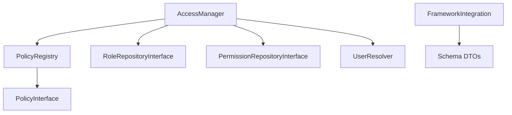

# Vima Core Architecture

Vima Core is designed with a **Contract-First** philosophy. It provides the essential logic and interfaces for authorization but remains completely agnostic about how data (users, roles, permissions) is persisted or how the current user is resolved.

## Core Design Principles

### 1. Independence
The core does not depend on any specific framework or ORM. It communicates with storage layers via **Contracts** (Interfaces).

### 2. Contract-First
Every major component is defined by an interface in `Vima\Core\Contracts`. Framework integrators should implement these interfaces to bridge Vima with their framework's database or identity system.

### 3. Service-Oriented
The library exposes its functionality through two main services:
- **AccessManager**: The primary entry point for authorization checks.
- **PolicyRegistry**: A central store for context-aware ABAC rules.

## Key Components

### AccessManager
The `AccessManager` orchestrates RBAC and ABAC checks. It handles:
- Checking if a user has a specific permission (RBAC).
- Evaluating class-based or callback-based policies (ABAC).
- Managing role and permission assignments.
- **Contextual Filtering**: Roles can have a `context` (e.g. workspace ID). The manager filters active roles based on the context provided at runtime.

### PolicyRegistry
The `PolicyRegistry` maps "abilities" (e.g., `edit`, `delete`) to specific logic. It supports:
- **Callback Policies**: Simple closures for quick checks.
- **Class-Based Policies**: Classes implementing `PolicyInterface` for complex resource-based rules.

### UserIdentity & UserInterface
Vima doesn't require users to be of a specific class. Instead, it expects user objects to implement `UserInterface` (for getting IDs and roles) or uses a `UserResolver` to bridge existing user models.

## Hybrid RBAC + ABAC
Vima allows you to mix both systems. A `can()` check can first verify if a user has a permission via a role (RBAC) and then refine that check with a context-aware policy (ABAC). Both RBAC and ABAC checks support optional namespacing to isolate resources.

## Schema-Driven Integration
To facilitate easier framework bridging, Vima includes a metadata schema system. Instead of hardcoding database fields, integrators can use the `Schema` DTOs to dynamically discover the required data structure. This ensures that features like "Namespace" or "Context" are automatically supported by all framework-specific adapters.

---
(c) Vima PHP <https://github.com/vimaphp>
